# IncidentIQ — Software Design Document (SDD)

**Document Owner:** Principal Software Engineer
**Status:** Approved for Implementation — Contract Document
**Version:** 1.1 (MVP1 Scope)
**Last Updated:** 2026-06-20

---

## 0. Purpose & Scope

This document is the binding design contract for **IncidentIQ**, an AI-powered Incident Intelligence Platform. It defines architecture, contracts, schemas, and conventions that all engineering work must conform to. No implementation should diverge from this document without a revision and sign-off. No source code is included here by design — this is a specification, not an implementation.

IncidentIQ allows engineering organizations to create, triage, and resolve operational incidents, augmented by an AI layer that auto-categorizes, auto-prioritizes, and surfaces a resolution suggestion via keyword-matched context.

### 0.1 MVP1 Scope Note

This revision (v1.1) scopes the system down to what's buildable and demonstrable as a focused MVP, while preserving the full event-driven architecture for future extension. The full stack — JWT auth, React dashboard, Spring Boot, PostgreSQL, Kafka, Redis, Elasticsearch, FastAPI, and a local LLM via Ollama — is in scope and unchanged. What's deferred to a later phase (MVP2) is the **semantic/AI-retrieval layer**, not any infrastructure component:

| Deferred to MVP2 | Reason |
|---|---|
| ❌ Embeddings | Not needed for keyword-based retrieval |
| ❌ Vector database / `dense_vector` fields | No vector search in MVP1 |
| ❌ LangChain | Direct Ollama HTTP calls are sufficient at this scope |
| ❌ Full RAG pipeline | Replaced with a simple keyword-lookup-then-prompt step |
| ❌ Confluence/GitHub integrations | Runbooks are seeded directly, no live ingestion |
| ❌ Document ingestion pipelines | Seed data loaded once at bootstrap, not continuously synced |

MVP1's AI tier is reduced to: **categorization, prioritization, and a keyword-matched resolution suggestion** — all via direct Ollama prompts, no embeddings, no vector search, no RAG framework. See Section 15 for the resulting workflow and Appendix C for the full MVP2 backlog.

---

## 1. High-Level Architecture

### 1.1 Overview

IncidentIQ is a polyglot, event-driven system composed of four tiers:

1. **Presentation Tier** — React + Vite SPA
2. **Core Service Tier** — Spring Boot 4 (Java 21) — system of record, auth, orchestration, owns PostgreSQL/Redis/Elasticsearch
3. **Intelligence Tier** — Python FastAPI — AI classification orchestration (talks to Ollama)
4. **Data/Infra Tier** — PostgreSQL, Redis, Elasticsearch, Kafka

The Core Service owns all transactional writes and is the only service exposed to the frontend. The Intelligence Service is an internal, Kafka-driven worker that asynchronously classifies incidents and reports results back via REST callback into the Core Service. This decouples user-facing latency from LLM inference latency.

**MVP1 note:** Redis and Elasticsearch are supporting stores attached to Spring Boot (caching and keyword search respectively) — they are not part of the AI pipeline. The AI pipeline itself is a straight line: Kafka → FastAPI → Ollama → classification result → callback to Spring Boot. No vector store, no embeddings sit in this path for MVP1.

### 1.2 Architecture Diagram

**1.2.1 System Architecture (full component view)**

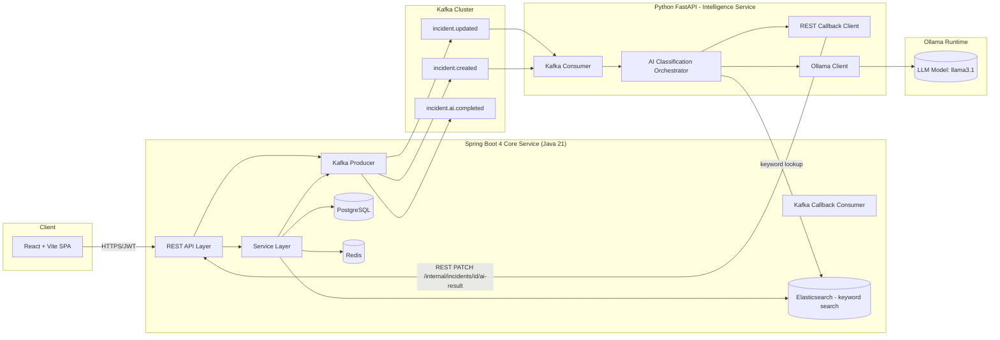

**1.2.2 MVP1 AI Flow (simplified, as sketched)**

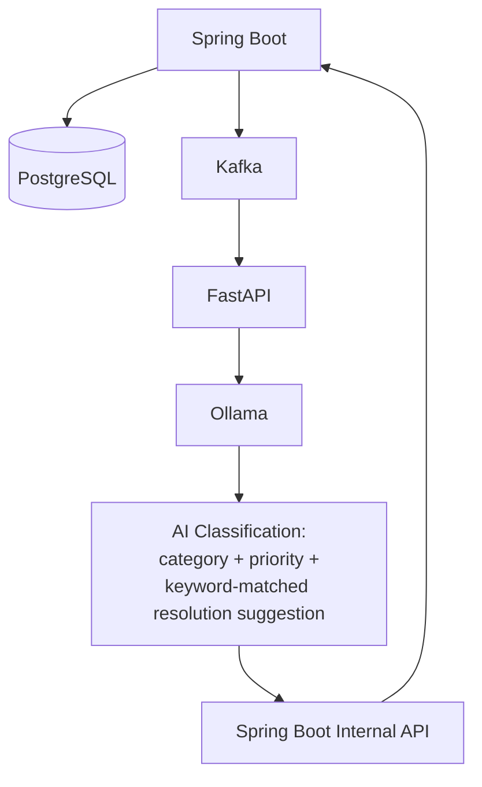

This is the core async loop for MVP1: Spring Boot writes the incident, fires a Kafka event, FastAPI classifies it via Ollama (pulling keyword-matched context from Elasticsearch where relevant), and writes the result back into Spring Boot via the internal REST callback — exactly as in Section 1.2.1, just without the embedding/vector branch.

### 1.3 Data Flow Summary

| Step | Actor | Action |
|---|---|---|
| 1 | React | User submits incident via authenticated REST call |
| 2 | Spring Boot | Validates, persists to PostgreSQL, indexes to Elasticsearch (keyword fields only), caches summary in Redis |
| 3 | Spring Boot | Publishes `incident.created` event to Kafka |
| 4 | FastAPI | Consumes event, calls Ollama for categorization and prioritization; performs a keyword lookup against Elasticsearch (runbooks/seeded historical incidents) and prompts Ollama with the top match for a resolution suggestion |
| 5 | FastAPI | Calls back into Spring Boot internal REST API with AI results |
| 6 | Spring Boot | Updates incident record, re-indexes ES, invalidates/refreshes Redis, publishes `incident.ai.completed` |
| 7 | React | Polls or receives updated incident with AI fields populated |

### 1.4 Why This Architecture

- **Async AI boundary via Kafka**: LLM inference (seconds) must never block the user-facing incident creation request (must remain < 200ms p99).
- **Spring Boot as system of record**: Single source of truth for authorization, validation, and transactional consistency avoids dual-write problems.
- **FastAPI as stateless AI worker**: Horizontally scalable independent of the core service; can be scaled based on Kafka consumer lag.
- **Elasticsearch for keyword search (MVP1)**: Standard `text`/`multi_match` queries over runbooks, seeded historical incidents, and service metadata are sufficient for resolution-suggestion context at this scope — no vector infrastructure required to deliver value.
- **Redis for hot-path caching**: Incident detail reads and dashboard aggregates are read-heavy; Redis absorbs read load from Postgres.
- **No RAG framework (MVP1)**: The "retrieve then prompt" pattern is implemented as two plain calls — an ES keyword query, then an Ollama prompt with the result as context — rather than a LangChain or similar orchestration layer, keeping the dependency surface minimal until semantic retrieval is actually needed.

---

## 2. Folder Structure

### 2.1 Repository Layout (Monorepo)

```
incidentiq/
├── backend-core/                  # Spring Boot 4 service
│   ├── src/
│   │   ├── main/
│   │   │   ├── java/com/incidentiq/core/
│   │   │   └── resources/
│   │   │       ├── application.yml
│   │   │       ├── application-dev.yml
│   │   │       ├── application-prod.yml
│   │   │       └── db/migration/         # Flyway migrations
│   │   └── test/
│   ├── pom.xml
│   └── Dockerfile
│
├── ai-service/                    # Python FastAPI service
│   ├── app/
│   │   ├── api/
│   │   ├── consumers/
│   │   ├── core/
│   │   ├── models/
│   │   ├── services/
│   │   ├── clients/
│   │   └── main.py
│   ├── tests/
│   ├── pyproject.toml
│   ├── requirements.txt
│   └── Dockerfile
│
├── frontend/                      # React + Vite SPA
│   ├── src/
│   │   ├── api/
│   │   ├── components/
│   │   ├── features/
│   │   │   ├── incidents/
│   │   │   ├── auth/
│   │   │   └── dashboard/
│   │   ├── hooks/
│   │   ├── store/
│   │   ├── routes/
│   │   └── main.tsx
│   ├── index.html
│   ├── vite.config.ts
│   ├── package.json
│   └── Dockerfile
│
├── infra/
│   ├── docker-compose.yml
│   ├── docker-compose.dev.yml
│   ├── kafka/
│   ├── elasticsearch/
│   │   └── mappings/incident-mapping.json
│   └── k8s/                       # optional future deployment manifests
│
├── docs/
│   ├── SDD.md                     # this document
│   ├── api-contracts/
│   └── diagrams/
│
└── README.md
```

---

## 3. Package Structure (Spring Boot Core Service)

Base package: `com.incidentiq.core`

```
com.incidentiq.core
├── IncidentIqApplication.java
│
├── config/
│   ├── SecurityConfig.java
│   ├── KafkaConfig.java
│   ├── RedisConfig.java
│   ├── ElasticsearchConfig.java
│   ├── OpenApiConfig.java
│   └── WebConfig.java
│
├── controller/
│   ├── AuthController.java
│   ├── IncidentController.java
│   ├── IncidentSearchController.java
│   └── internal/
│       └── InternalAiCallbackController.java
│
├── service/
│   ├── AuthService.java
│   ├── IncidentService.java
│   ├── IncidentSearchService.java
│   ├── IncidentCacheService.java
│   └── AiCallbackService.java
│
├── kafka/
│   ├── producer/
│   │   └── IncidentEventProducer.java
│   └── consumer/
│       └── AiResultAckConsumer.java
│
├── repository/
│   ├── jpa/
│   │   ├── IncidentRepository.java
│   │   ├── UserRepository.java
│   │   └── IncidentHistoryRepository.java
│   └── elasticsearch/
│       └── IncidentSearchRepository.java
│
├── domain/
│   ├── entity/
│   │   ├── Incident.java
│   │   ├── User.java
│   │   ├── IncidentHistory.java
│   │   └── IncidentComment.java
│   └── enums/
│       ├── IncidentStatus.java
│       ├── IncidentPriority.java
│       ├── IncidentCategory.java
│       └── Role.java
│
├── dto/
│   ├── request/
│   ├── response/
│   └── event/
│
├── mapper/
│   └── IncidentMapper.java
│
├── security/
│   ├── JwtTokenProvider.java
│   ├── JwtAuthenticationFilter.java
│   ├── CustomUserDetailsService.java
│   └── SecurityConstants.java
│
├── exception/
│   ├── GlobalExceptionHandler.java
│   ├── IncidentNotFoundException.java
│   ├── UnauthorizedAccessException.java
│   └── ValidationException.java
│
└── util/
    ├── DateUtils.java
    └── PageResponseUtils.java
```

### 3.1 Package Structure (FastAPI AI Service)

```
app/
├── main.py
├── api/
│   └── v1/
│       └── health.py
├── consumers/
│   └── incident_event_consumer.py
├── core/
│   ├── config.py
│   ├── logging.py
│   └── kafka_settings.py
├── services/
│   ├── categorization_service.py
│   ├── prioritization_service.py
│   └── resolution_suggestion_service.py   # keyword lookup + prompt, no RAG framework
├── clients/
│   ├── ollama_client.py
│   ├── elasticsearch_client.py            # keyword search against runbooks/incidents
│   └── core_service_client.py
├── models/
│   ├── incident_event.py
│   └── ai_result.py
└── schemas/
    └── ai_payloads.py
```

---

## 4. Database Schema (PostgreSQL)

### 4.1 Tables

**`users`**

| Column | Type | Constraints |
|---|---|---|
| id | UUID | PK, default `gen_random_uuid()` |
| email | VARCHAR(255) | UNIQUE, NOT NULL |
| password_hash | VARCHAR(255) | NOT NULL |
| full_name | VARCHAR(255) | NOT NULL |
| role | VARCHAR(20) | NOT NULL, CHECK IN ('ADMIN','ENGINEER','VIEWER') |
| created_at | TIMESTAMPTZ | NOT NULL, default now() |
| updated_at | TIMESTAMPTZ | NOT NULL, default now() |

**`incidents`**

| Column | Type | Constraints |
|---|---|---|
| id | UUID | PK, default `gen_random_uuid()` |
| title | VARCHAR(255) | NOT NULL |
| description | TEXT | NOT NULL |
| status | VARCHAR(20) | NOT NULL, default 'OPEN', CHECK IN ('OPEN','IN_PROGRESS','RESOLVED','CLOSED') |
| priority | VARCHAR(10) | NULLABLE, CHECK IN ('P1','P2','P3','P4') — set by AI or human |
| category | VARCHAR(50) | NULLABLE — set by AI or human |
| ai_resolution_suggestion | TEXT | NULLABLE |
| ai_confidence_score | NUMERIC(4,3) | NULLABLE |
| ai_processed | BOOLEAN | NOT NULL, default false |
| embedding_vector_id | VARCHAR(64) | NULLABLE — **reserved for MVP2**; not written to in MVP1 (no embeddings generated) |
| reporter_id | UUID | FK → users.id, NOT NULL |
| assignee_id | UUID | FK → users.id, NULLABLE |
| created_at | TIMESTAMPTZ | NOT NULL, default now() |
| updated_at | TIMESTAMPTZ | NOT NULL, default now() |
| resolved_at | TIMESTAMPTZ | NULLABLE |

**`incident_history`**

| Column | Type | Constraints |
|---|---|---|
| id | UUID | PK |
| incident_id | UUID | FK → incidents.id, NOT NULL |
| field_changed | VARCHAR(100) | NOT NULL |
| old_value | TEXT | NULLABLE |
| new_value | TEXT | NULLABLE |
| changed_by | UUID | FK → users.id, NOT NULL |
| changed_at | TIMESTAMPTZ | NOT NULL, default now() |

**`incident_comments`**

| Column | Type | Constraints |
|---|---|---|
| id | UUID | PK |
| incident_id | UUID | FK → incidents.id, NOT NULL |
| author_id | UUID | FK → users.id, NOT NULL |
| body | TEXT | NOT NULL |
| created_at | TIMESTAMPTZ | NOT NULL, default now() |

### 4.2 Indexes

- `idx_incidents_status` on `incidents(status)`
- `idx_incidents_priority` on `incidents(priority)`
- `idx_incidents_reporter` on `incidents(reporter_id)`
- `idx_incidents_created_at` on `incidents(created_at DESC)`
- `idx_history_incident_id` on `incident_history(incident_id)`
- `idx_comments_incident_id` on `incident_comments(incident_id)`

### 4.3 Migration Strategy

Flyway manages schema migrations: `V1__init_schema.sql`, `V2__add_ai_columns.sql`, etc. No manual DDL in production.

---

## 5. Entity Relationship Diagram

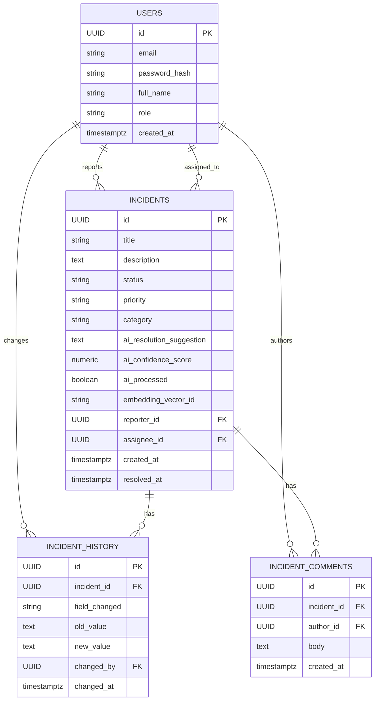

---

## 6. REST APIs

### 6.1 Public / Frontend-Facing APIs (Spring Boot)

| Method | Path | Description | Auth |
|---|---|---|---|
| POST | `/api/v1/auth/register` | Register new user | None |
| POST | `/api/v1/auth/login` | Authenticate, returns JWT pair | None |
| POST | `/api/v1/auth/refresh` | Refresh access token | Refresh Token |
| POST | `/api/v1/incidents` | Create incident | Bearer JWT |
| GET | `/api/v1/incidents/{id}` | Get incident by ID | Bearer JWT |
| PUT | `/api/v1/incidents/{id}` | Update incident | Bearer JWT |
| PATCH | `/api/v1/incidents/{id}/resolve` | Resolve incident | Bearer JWT |
| DELETE | `/api/v1/incidents/{id}` | Soft-delete/close incident | Bearer JWT (ADMIN) |
| GET | `/api/v1/incidents` | List incidents (paginated, filterable) | Bearer JWT |
| GET | `/api/v1/incidents/search?q=` | Keyword search via Elasticsearch (`incidents` index) | Bearer JWT |
| GET | `/api/v1/runbooks/search?q=` | Keyword search over seeded runbooks (`runbooks` index) | Bearer JWT |
| POST | `/api/v1/incidents/{id}/comments` | Add comment | Bearer JWT |
| GET | `/api/v1/incidents/{id}/history` | Get audit trail | Bearer JWT |

> **MVP2 (deferred):** `GET /api/v1/incidents/{id}/similar` — AI-powered semantic similar-incident search via embeddings. Not part of MVP1 (see Section 0.1 / Appendix C).

### 6.2 Internal APIs (FastAPI → Spring Boot Callback)

| Method | Path | Description | Auth |
|---|---|---|---|
| PATCH | `/internal/api/v1/incidents/{id}/ai-result` | Write back AI categorization, priority, and keyword-matched resolution suggestion | Internal Service Token (mTLS or static service JWT) |

These endpoints are excluded from public Swagger and protected by a separate `INTERNAL_SERVICE` security filter chain, accessible only from the internal network/service mesh.

### 6.3 FastAPI Internal Endpoints

| Method | Path | Description |
|---|---|---|
| GET | `/health` | Liveness/readiness probe |
| POST | `/internal/ai/classify` | (Optional sync debug endpoint) on-demand categorization + prioritization |

---

## 7. DTOs

### 7.1 Request DTOs

**`CreateIncidentRequest`**
```
title: String (3-255 chars, required)
description: String (10-5000 chars, required)
reporterId: UUID (required, derived from JWT principal — not client-supplied)
```

**`UpdateIncidentRequest`**
```
title: String (optional)
description: String (optional)
status: IncidentStatus (optional)
assigneeId: UUID (optional)
```

**`ResolveIncidentRequest`**
```
resolutionNotes: String (required, 10-5000 chars)
```

**`LoginRequest`**
```
email: String (required, valid email)
password: String (required, min 8 chars)
```

**`AddCommentRequest`**
```
body: String (required, 1-2000 chars)
```

### 7.2 Response DTOs

**`IncidentResponse`**
```
id: UUID
title: String
description: String
status: IncidentStatus
priority: IncidentPriority | null
category: String | null
aiResolutionSuggestion: String | null
aiConfidenceScore: BigDecimal | null
aiProcessed: boolean
reporter: UserSummary
assignee: UserSummary | null
createdAt: Instant
updatedAt: Instant
resolvedAt: Instant | null
```

**`UserSummary`**
```
id: UUID
fullName: String
email: String
```

**`AuthResponse`**
```
accessToken: String
refreshToken: String
tokenType: "Bearer"
expiresInSeconds: long
```

**`PageResponse<T>`**
```
content: List<T>
page: int
size: int
totalElements: long
totalPages: int
```

**`RunbookMatchResponse`** (used internally by resolution-suggestion lookup; surfaced as part of the AI result, not a standalone endpoint in MVP1)
```
runbookId: String
title: String
matchScore: float
service: String | null
```

> **MVP2 (deferred):** `SimilarIncidentResponse` — semantic similar-incident search response (`incidentId`, `title`, `similarityScore`, `status`, `resolvedAt`). Not part of MVP1.

### 7.3 Internal Callback DTO

**`AiResultCallbackRequest`** (FastAPI → Spring Boot)
```
incidentId: UUID
category: String
priority: IncidentPriority
resolutionSuggestion: String
confidenceScore: BigDecimal
modelUsed: String
processedAt: Instant
```

---

## 8. Kafka Topics

| Topic | Producer | Consumer | Partitions | Retention | Key |
|---|---|---|---|---|---|
| `incident.created` | Spring Boot | FastAPI | 6 | 7 days | `incidentId` |
| `incident.updated` | Spring Boot | FastAPI | 6 | 7 days | `incidentId` |
| `incident.ai.completed` | Spring Boot (after callback applied) | (future) Notification service | 3 | 7 days | `incidentId` |
| `incident.ai.dlq` | FastAPI (on failure) | Ops / replay tooling | 1 | 14 days | `incidentId` |

**Partition key rationale:** Keying by `incidentId` guarantees ordered processing of events for the same incident, preventing race conditions between `created` and subsequent `updated` AI re-processing.

**Consumer group:** FastAPI service runs as consumer group `ai-intelligence-service`, horizontally scalable up to the partition count (6).

---

## 9. Kafka Event Payloads

### 9.1 `incident.created`

```json
{
  "eventId": "uuid",
  "eventType": "INCIDENT_CREATED",
  "incidentId": "uuid",
  "title": "Payment gateway returning 500s",
  "description": "Checkout failing intermittently since 14:02 UTC...",
  "reporterId": "uuid",
  "createdAt": "2026-06-20T14:05:00Z",
  "schemaVersion": "1.0"
}
```

### 9.2 `incident.updated`

```json
{
  "eventId": "uuid",
  "eventType": "INCIDENT_UPDATED",
  "incidentId": "uuid",
  "changedFields": ["description", "status"],
  "title": "Payment gateway returning 500s",
  "description": "Updated description with new logs attached...",
  "requiresReprocessing": true,
  "updatedAt": "2026-06-20T14:20:00Z",
  "schemaVersion": "1.0"
}
```

### 9.3 `incident.ai.completed`

```json
{
  "eventId": "uuid",
  "eventType": "INCIDENT_AI_COMPLETED",
  "incidentId": "uuid",
  "category": "PAYMENTS",
  "priority": "P1",
  "confidenceScore": 0.91,
  "modelUsed": "llama3.1:8b",
  "completedAt": "2026-06-20T14:05:09Z",
  "schemaVersion": "1.0"
}
```

### 9.4 `incident.ai.dlq`

```json
{
  "eventId": "uuid",
  "originalTopic": "incident.created",
  "incidentId": "uuid",
  "errorMessage": "Ollama timeout after 30000ms",
  "retryCount": 3,
  "failedAt": "2026-06-20T14:06:00Z"
}
```

**Schema governance:** All payloads are versioned (`schemaVersion`) and validated against JSON Schema definitions stored in `docs/api-contracts/kafka-schemas/`. Breaking changes require a new topic or version bump with dual-publish during migration.

---

## 10. Redis Cache Strategy

| Use Case | Strategy | TTL |
|---|---|---|
| Incident detail (`GET /incidents/{id}`) | Cache-aside; write-through invalidation on update/resolve | 10 min |
| Incident list (filtered, paginated) | Cache-aside, short TTL due to write frequency | 30 sec |
| User session / JWT blacklist (logout) | Write-through, lookup on every authenticated request | Token TTL |
| Dashboard aggregate counts (open/P1 counts) | Cache-aside, refreshed by scheduled job every 60s | 60 sec |
| Rate limiting (per-user request bucket) | Token bucket counter via `INCR` + `EXPIRE` | 60 sec rolling |
| Runbook keyword search results | Cache-aside (avoids repeated ES round-trips for common queries) | 5 min |

**Invalidation rule:** Any write to `incidents` table (create/update/resolve/AI callback) invalidates `incident:detail:{id}` and triggers a list-cache bump via a version counter key (`incident:list:version`) rather than scanning/deleting wildcard keys.

---

## 11. Redis Key Naming

| Key Pattern | Example | Purpose |
|---|---|---|
| `incident:detail:{incidentId}` | `incident:detail:7f3a...` | Cached `IncidentResponse` JSON |
| `incident:list:v{version}:{filtersHash}:{page}:{size}` | `incident:list:v42:status=OPEN:0:20` | Cached paginated list |
| `incident:list:version` | `incident:list:version` | Monotonic counter, bump on any incident write |
| `runbook:search:{queryHash}` | `runbook:search:9f1c...` | Cached keyword search results |
| `dashboard:counts:open` | `dashboard:counts:open` | Cached aggregate count |
| `auth:jwt:blacklist:{jti}` | `auth:jwt:blacklist:f81d...` | Blacklisted/revoked token IDs |
| `auth:refresh:{userId}` | `auth:refresh:9e21...` | Active refresh token reference |
| `ratelimit:{userId}:{endpoint}` | `ratelimit:9e21...:create-incident` | Token bucket counter |

**Convention:** `{domain}:{entity}:{qualifier}` — all lowercase, colon-delimited, no spaces.

---

## 12. Elasticsearch Mapping

MVP1 uses **keyword search only** — three indices, all standard `text`/`keyword` fields, no `dense_vector`, no kNN. Historical incidents are not a separate index; the 20–30 seeded incidents live in the `incidents` index itself (status `RESOLVED`), so a single keyword query against `incidents` already covers "search past incidents."

### 12.1 Index: `incidents`

```json
{
  "mappings": {
    "properties": {
      "id": { "type": "keyword" },
      "title": {
        "type": "text",
        "analyzer": "standard",
        "fields": { "keyword": { "type": "keyword" } }
      },
      "description": {
        "type": "text",
        "analyzer": "standard"
      },
      "status": { "type": "keyword" },
      "priority": { "type": "keyword" },
      "category": { "type": "keyword" },
      "reporterId": { "type": "keyword" },
      "assigneeId": { "type": "keyword" },
      "aiResolutionSuggestion": { "type": "text" },
      "createdAt": { "type": "date" },
      "updatedAt": { "type": "date" },
      "resolvedAt": { "type": "date" }
    }
  },
  "settings": {
    "number_of_shards": 3,
    "number_of_replicas": 1,
    "analysis": {
      "analyzer": {
        "standard": { "type": "standard" }
      }
    }
  }
}
```

### 12.2 Index: `runbooks`

Seeded once at bootstrap from 10–15 Markdown runbook files (parsed to plain text; no live ingestion pipeline in MVP1).

```json
{
  "mappings": {
    "properties": {
      "id": { "type": "keyword" },
      "title": {
        "type": "text",
        "analyzer": "standard",
        "fields": { "keyword": { "type": "keyword" } }
      },
      "body": {
        "type": "text",
        "analyzer": "standard"
      },
      "tags": { "type": "keyword" },
      "service": { "type": "keyword" },
      "lastUpdated": { "type": "date" }
    }
  },
  "settings": {
    "number_of_shards": 1,
    "number_of_replicas": 1
  }
}
```

### 12.3 Index: `service_metadata`

Seeded once from a simple JSON file at bootstrap; used for filtering/context, not full-text ranking.

```json
{
  "mappings": {
    "properties": {
      "serviceName": { "type": "keyword" },
      "owner": { "type": "keyword" },
      "tier": { "type": "keyword" },
      "dependencies": { "type": "keyword" },
      "description": { "type": "text" }
    }
  },
  "settings": {
    "number_of_shards": 1,
    "number_of_replicas": 1
  }
}
```

### 12.4 Search Strategy (MVP1)

- `GET /api/v1/incidents/search?q=` → `multi_match` query against `incidents.title` (boosted `title^2`) and `incidents.description`.
- `GET /api/v1/runbooks/search?q=` → `multi_match` query against `runbooks.title` (boosted `title^2`) and `runbooks.body`.
- **Resolution suggestion lookup (internal, used by FastAPI):** `multi_match` query against `runbooks` (and optionally `incidents` filtered to `status: RESOLVED`) using the new incident's title + description as the query text; top 1–3 hits are passed as plain-text context into the Ollama prompt. This is the entire "retrieval" step — no vector math, no LangChain retriever abstraction, just an ES query followed by a prompt template.

> **MVP2 (deferred):** `embeddingVector` (`dense_vector`, 768 dims, cosine similarity) on `incidents`, plus a `knn` query for `/incidents/{id}/similar`. See Appendix C.

---

## 13. Authentication Flow

1. User submits credentials to `POST /api/v1/auth/login`.
2. Spring Boot validates against `users` table (BCrypt password match).
3. On success, `JwtTokenProvider` issues:
    - **Access Token** (short-lived, 15 min, signed HS256/RS256)
    - **Refresh Token** (long-lived, 7 days, stored server-side reference in Redis)
4. Tokens returned to client; access token stored in memory (not localStorage) on the React side; refresh token in an `HttpOnly`, `Secure`, `SameSite=Strict` cookie.
5. Every subsequent request includes `Authorization: Bearer <accessToken>`.
6. `JwtAuthenticationFilter` validates signature, expiry, and Redis blacklist on every request before reaching the controller.
7. On access token expiry, client calls `POST /api/v1/auth/refresh` with the refresh cookie; Spring Boot validates against the Redis-stored reference and issues a new access token (refresh token rotation on each use).
8. On logout, the access token's `jti` is added to `auth:jwt:blacklist:{jti}` in Redis until its natural expiry, and the refresh token reference is deleted.

---

## 14. JWT Flow (Detail)

### 14.1 Token Structure

**Access Token Claims:**
```
sub: userId
email: string
role: ADMIN | ENGINEER | VIEWER
jti: unique token id
iat: issued-at
exp: expiry (iat + 15min)
typ: "access"
```

**Refresh Token Claims:**
```
sub: userId
jti: unique token id
iat: issued-at
exp: expiry (iat + 7d)
typ: "refresh"
```

### 14.2 Flow Diagram

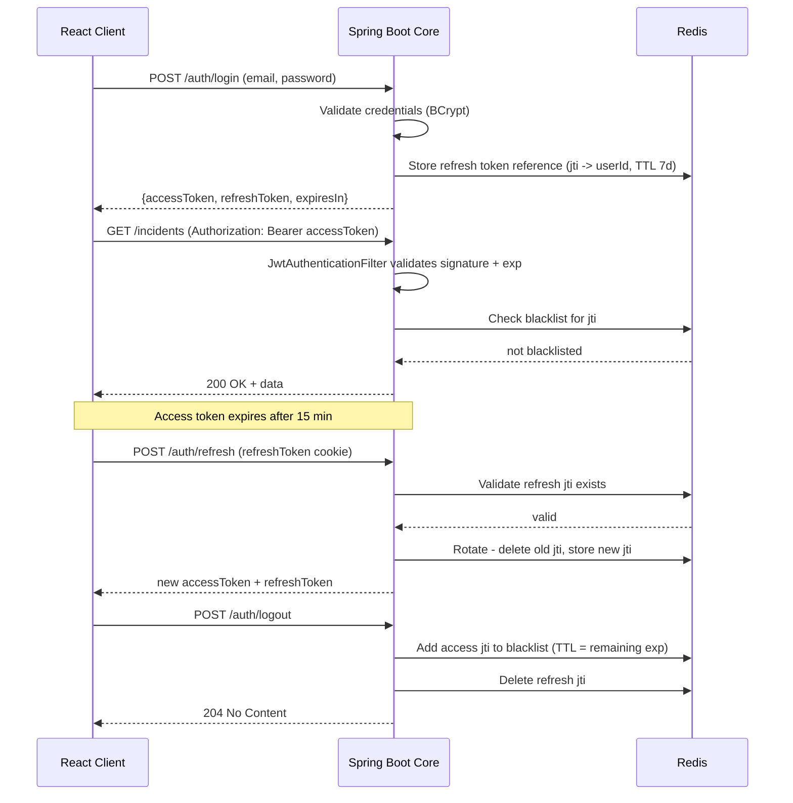

### 14.3 Authorization Model (RBAC)

| Role | Permissions |
|---|---|
| `VIEWER` | Read incidents, search, view history |
| `ENGINEER` | All VIEWER permissions + create, update, resolve, comment |
| `ADMIN` | All ENGINEER permissions + delete/close, manage users |

Enforced via `@PreAuthorize` method-level security annotations mapped from JWT `role` claim.

---

## 15. AI Workflow

### 15.1 Workflow Stages (MVP1)

1. **Trigger** — Spring Boot publishes `incident.created` (or `incident.updated` with `requiresReprocessing=true`) to Kafka.
2. **Consume** — FastAPI's `incident_event_consumer` picks up the event from consumer group `ai-intelligence-service`.
3. **Categorization** — `categorization_service` prompts Ollama (`llama3.1:8b`) with title + description, constrained to a fixed taxonomy (e.g., `PAYMENTS`, `AUTH`, `INFRA`, `DATABASE`, `NETWORK`, `UNKNOWN`) via structured-output prompting.
4. **Prioritization** — `prioritization_service` prompts Ollama with severity-indicative signals (keywords, affected-system hints, historical P1 patterns) to output `P1`–`P4` plus a confidence score.
5. **Keyword Lookup** — `resolution_suggestion_service` runs a plain `multi_match` query against the `runbooks` index (and optionally `incidents` filtered to `status: RESOLVED`) using the incident's title + description as query text. Top 1–3 hits are retrieved as plain text — no embeddings, no kNN.
6. **Resolution Suggestion** — the top keyword match(es) are inserted as context into a single Ollama prompt template ("given this incident and this matched runbook, suggest a resolution"); Ollama returns the suggestion text. This is a manual two-step "retrieve then prompt," not a RAG framework.
7. **Callback** — `core_service_client` issues `PATCH /internal/api/v1/incidents/{id}/ai-result` to Spring Boot with category, priority, confidence score, and resolution suggestion.
8. **Persist & Propagate** — Spring Boot updates Postgres, re-indexes the incident in Elasticsearch (keyword fields only), invalidates Redis cache, and publishes `incident.ai.completed`.
9. **Failure Handling** — On Ollama timeout/error, FastAPI retries up to 3 times with exponential backoff; on exhaustion, publishes to `incident.ai.dlq` and the incident remains with `aiProcessed=false` for manual or scheduled reprocessing.

### 15.2 AI Workflow Diagram

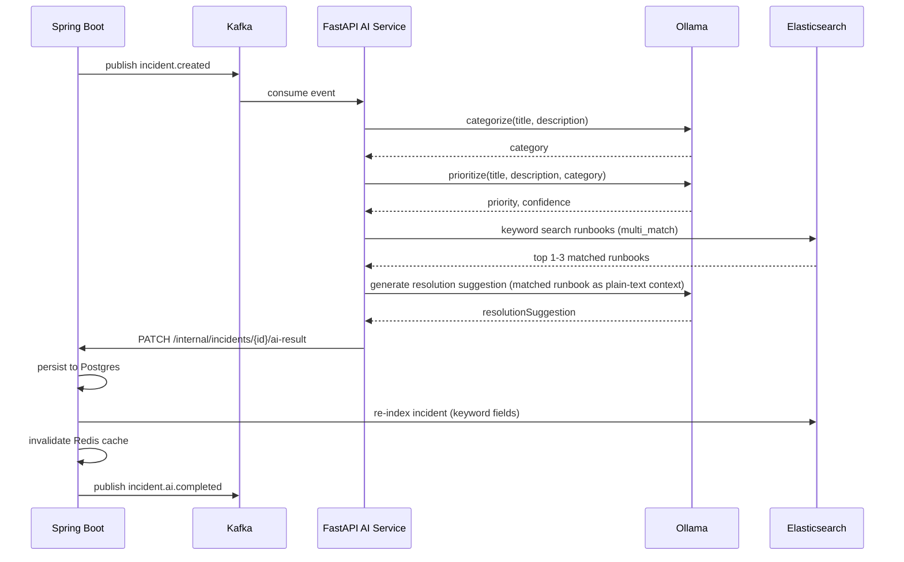

### 15.3 Model Inventory

| Purpose | Model | Notes |
|---|---|---|
| Categorization / Prioritization / Resolution text | `llama3.1:8b` | Served locally via Ollama, structured-output prompting with JSON schema constraint |

> **MVP2 (deferred):** `nomic-embed-text` for embeddings, used only once vector search / true RAG is reintroduced. See Appendix C.

---

## 16. Docker Containers

| Container | Image Base | Purpose | Exposed Port |
|---|---|---|---|
| `incidentiq-frontend` | `node:22-alpine` (build) → `nginx:alpine` (serve) | React SPA | 80 |
| `incidentiq-core` | `eclipse-temurin:21-jre` | Spring Boot 4 API | 8080 |
| `incidentiq-ai` | `python:3.12-slim` | FastAPI AI service | 8000 |
| `incidentiq-postgres` | `postgres:16` | Primary datastore | 5432 |
| `incidentiq-redis` | `redis:7-alpine` | Cache | 6379 |
| `incidentiq-elasticsearch` | `elasticsearch:8.15.0` | Search + vector index | 9200 |
| `incidentiq-kafka` | `confluentinc/cp-kafka:7.6.0` | Event broker | 9092 |
| `incidentiq-zookeeper` | `confluentinc/cp-zookeeper:7.6.0` | Kafka coordination | 2181 |
| `incidentiq-ollama` | `ollama/ollama:latest` | Local LLM runtime | 11434 |

All services are orchestrated via `infra/docker-compose.yml` on a shared bridge network `incidentiq-net`, with named volumes for `postgres-data`, `esdata`, and `ollama-models`.

---

## 17. Sequence Diagrams

### 17.1 Create Incident (End-to-End)

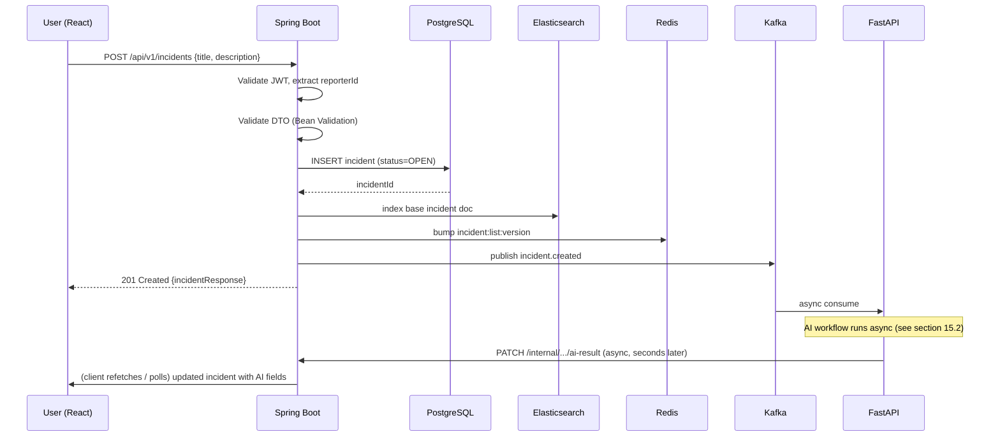

### 17.2 Search Incidents

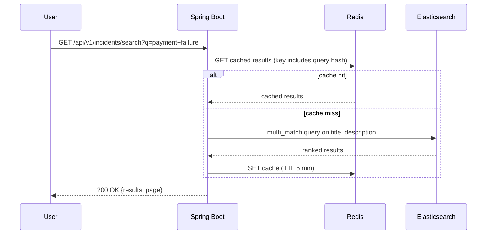

### 17.3 Resolve Incident

```mermaid
sequenceDiagram
    participant U as User
    participant SB as Spring Boot
    participant PG as PostgreSQL
    participant R as Redis
    participant K as Kafka

    U->>SB: PATCH /api/v1/incidents/{id}/resolve {resolutionNotes}
    SB->>SB: Authorize (ENGINEER or ADMIN)
    SB->>PG: UPDATE status=RESOLVED, resolved_at=now()
    SB->>PG: INSERT incident_history (status change)
    SB->>R: DEL incident:detail:{id}; bump list version
    SB->>K: publish incident.updated (requiresReprocessing=false)
    SB-->>U: 200 OK {incidentResponse}
```

---

## 18. Component Diagram

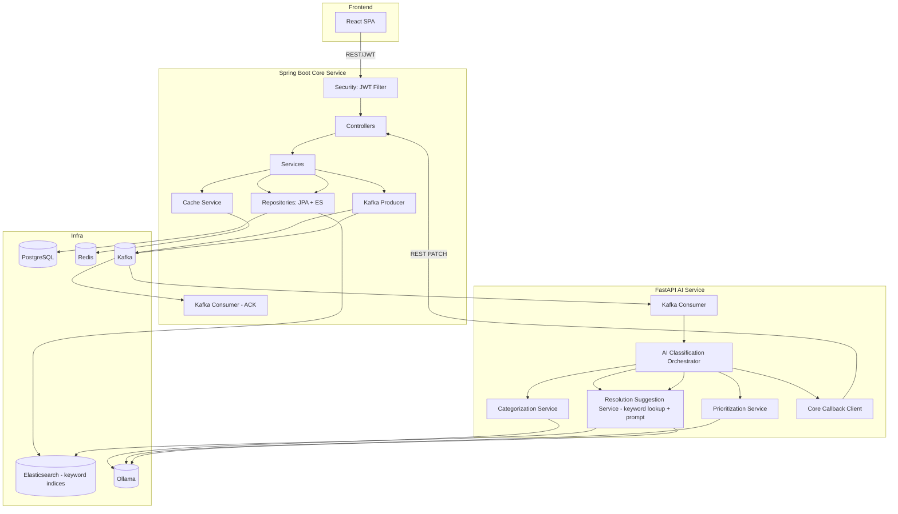

---

## 19. Class Diagram (Core Domain — Spring Boot)

```mermaid
classDiagram
    class Incident {
        -UUID id
        -String title
        -String description
        -IncidentStatus status
        -IncidentPriority priority
        -String category
        -String aiResolutionSuggestion
        -BigDecimal aiConfidenceScore
        -boolean aiProcessed
        -UUID reporterId
        -UUID assigneeId
        -Instant createdAt
        -Instant updatedAt
        -Instant resolvedAt
        +resolve(notes) void
        +assignTo(userId) void
        +applyAiResult(result) void
    }

    class User {
        -UUID id
        -String email
        -String passwordHash
        -String fullName
        -Role role
    }

    class IncidentHistory {
        -UUID id
        -UUID incidentId
        -String fieldChanged
        -String oldValue
        -String newValue
        -UUID changedBy
        -Instant changedAt
    }

    class IncidentComment {
        -UUID id
        -UUID incidentId
        -UUID authorId
        -String body
        -Instant createdAt
    }

    class IncidentService {
        +createIncident(dto) IncidentResponse
        +updateIncident(id, dto) IncidentResponse
        +resolveIncident(id, dto) IncidentResponse
        +getIncident(id) IncidentResponse
        +listIncidents(filters, page) PageResponse
        +applyAiResult(callback) void
    }

    class IncidentSearchService {
        +search(query, page) PageResponse
    }

    class IncidentEventProducer {
        +publishCreated(incident) void
        +publishUpdated(incident, changedFields) void
        +publishAiCompleted(incident) void
    }

    class JwtTokenProvider {
        +generateAccessToken(user) String
        +generateRefreshToken(user) String
        +validateToken(token) boolean
        +getClaims(token) Claims
    }

    Incident "1" --> "many" IncidentHistory : tracks
    Incident "1" --> "many" IncidentComment : has
    User "1" --> "many" Incident : reports
    IncidentService --> Incident
    IncidentService --> IncidentEventProducer
    IncidentSearchService --> Incident
```

---

## 20. Deployment Diagram

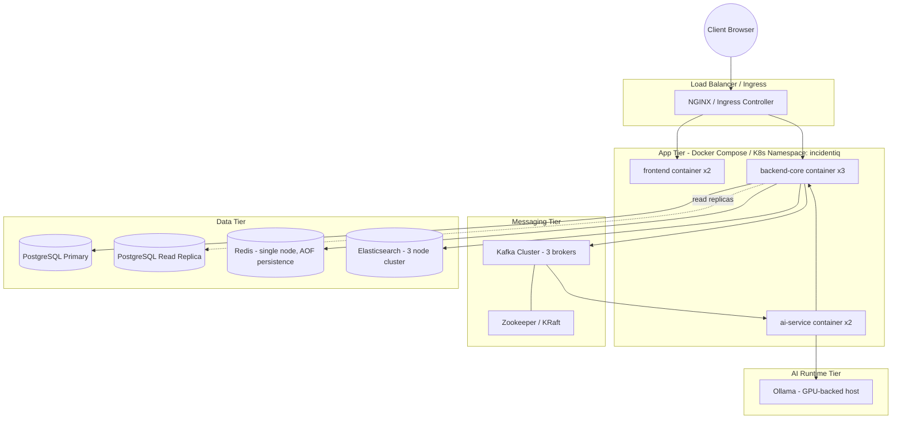

**Notes:**
- Backend-core and ai-service are stateless and horizontally scaled independently behind the load balancer / Kafka consumer group respectively.
- Ollama is deployed on a GPU-backed host (or node pool) separate from CPU-bound services for cost efficiency.
- PostgreSQL read replica is optional for v1 but reserved in the design for reporting/analytics read offload.

---

## 21. API Error Responses

### 21.1 Standard Error Envelope

```json
{
  "timestamp": "2026-06-20T14:05:00Z",
  "status": 404,
  "error": "NOT_FOUND",
  "message": "Incident with id 7f3a... was not found",
  "path": "/api/v1/incidents/7f3a...",
  "traceId": "a1b2c3d4"
}
```

### 21.2 Error Catalog

| HTTP Status | Error Code | Scenario |
|---|---|---|
| 400 | `VALIDATION_ERROR` | Request body fails Bean Validation |
| 401 | `UNAUTHENTICATED` | Missing/invalid/expired JWT |
| 403 | `FORBIDDEN` | Valid JWT but insufficient role |
| 404 | `NOT_FOUND` | Incident/user not found |
| 409 | `CONFLICT` | Duplicate email on registration; optimistic lock conflict on update |
| 422 | `UNPROCESSABLE_ENTITY` | Business rule violation (e.g., resolving an already-closed incident) |
| 429 | `RATE_LIMITED` | Redis-based rate limit exceeded |
| 500 | `INTERNAL_ERROR` | Unhandled exception |
| 503 | `SERVICE_UNAVAILABLE` | Downstream dependency (ES/Kafka) unreachable |

### 21.3 Validation Error Detail Format

```json
{
  "timestamp": "2026-06-20T14:05:00Z",
  "status": 400,
  "error": "VALIDATION_ERROR",
  "message": "Request validation failed",
  "fieldErrors": [
    { "field": "title", "message": "must be between 3 and 255 characters" },
    { "field": "description", "message": "must not be blank" }
  ],
  "path": "/api/v1/incidents",
  "traceId": "a1b2c3d4"
}
```

---

## 22. Validation Rules

| Field | Rule |
|---|---|
| `incident.title` | Required, 3–255 chars, no leading/trailing whitespace |
| `incident.description` | Required, 10–5000 chars |
| `incident.status` | Must be one of enum values; state transitions enforced (`OPEN → IN_PROGRESS → RESOLVED → CLOSED`, no skipping backward except ADMIN override) |
| `incident.priority` | One of `P1`–`P4`; immutable by client once set by AI unless ADMIN override |
| `user.email` | Required, valid RFC 5322 email, unique |
| `user.password` | Required, min 8 chars, at least 1 number and 1 letter (registration only) |
| `comment.body` | Required, 1–2000 chars |
| `resolutionNotes` | Required, 10–5000 chars when resolving |
| Pagination `page` | >= 0 |
| Pagination `size` | 1–100, default 20 |

**Enforcement layer:** Jakarta Bean Validation annotations (`@NotBlank`, `@Size`, `@Email`, `@Pattern`) on DTOs, plus custom `@ValidStatusTransition` validator for state machine enforcement. Business-rule validations (e.g., re-resolving a closed incident) handled in the service layer, raising `ValidationException` → mapped to `422`.

---

## 23. Logging Strategy

- **Format:** Structured JSON logs (via Logback `LogstashEncoder` in Spring Boot; `structlog` in FastAPI) for downstream aggregation (e.g., ELK / Loki).
- **Correlation:** Every inbound request generates/propagates a `traceId` (via `MDC` in Spring Boot, header `X-Trace-Id`), which is also embedded in Kafka event payloads so the same `traceId` can be followed across Spring Boot → Kafka → FastAPI → Ollama → callback.
- **Log Levels:**
    - `ERROR` — unhandled exceptions, downstream failures (Kafka publish failure, Ollama timeout exhaustion)
    - `WARN` — retries, cache misses on critical paths, validation failures
    - `INFO` — incident lifecycle events (created/updated/resolved), auth events (login/logout)
    - `DEBUG` — query parameters, cache key construction (disabled in prod)
- **PII Handling:** Never log full request/response bodies containing passwords or tokens; mask `email` partially in non-debug logs.
- **AI-specific logging:** FastAPI logs prompt template version, model name, and latency per inference call (not full prompt/response content in production, to control log volume — sampled at 1% for quality audits).

---

## 24. Exception Handling Strategy

### 24.1 Spring Boot

- Centralized `@RestControllerAdvice` (`GlobalExceptionHandler`) maps all custom and framework exceptions to the standard error envelope (Section 21.1).
- Custom exception hierarchy rooted at `IncidentIqException` (unchecked), with subtypes: `IncidentNotFoundException`, `ValidationException`, `UnauthorizedAccessException`, `ConflictException`.
- Downstream failures (Kafka unavailable, ES unreachable) are caught at the service boundary and translated to `503 SERVICE_UNAVAILABLE`; incident creation still succeeds in Postgres even if the Kafka publish fails — publish failure is logged and retried via an outbox-pattern fallback (scheduled reconciliation job) to guarantee at-least-once AI processing.
- Optimistic locking (`@Version` on `Incident`) raises `OptimisticLockingFailureException` → mapped to `409 CONFLICT` on concurrent updates.

### 24.2 FastAPI

- Global exception handlers registered via `@app.exception_handler` for `OllamaTimeoutError`, `ValidationError`, and generic `Exception`.
- Kafka consumer wraps each message-processing call in a try/except; on failure, retries with exponential backoff (3 attempts), then routes to `incident.ai.dlq` rather than blocking the partition (avoids consumer lag pile-up).
- Callback REST calls to Spring Boot use a circuit breaker (via `tenacity` retry + backoff) to avoid hammering the core service during an outage.

---

## 25. Naming Conventions

| Element | Convention | Example |
|---|---|---|
| Java classes | UpperCamelCase | `IncidentService` |
| Java methods/variables | lowerCamelCase | `createIncident()` |
| Java constants | UPPER_SNAKE_CASE | `MAX_PAGE_SIZE` |
| REST paths | kebab-case, plural nouns | `/api/v1/incident-comments` |
| JSON fields | lowerCamelCase | `aiConfidenceScore` |
| DB tables/columns | snake_case | `ai_confidence_score` |
| Kafka topics | dot.separated, lowercase | `incident.ai.completed` |
| Python modules/functions | snake_case | `categorize_incident()` |
| Python classes | UpperCamelCase | `CategorizationService` |
| React components | UpperCamelCase | `IncidentDetailCard.tsx` |
| React hooks | camelCase, `use` prefix | `useIncidentList()` |
| Redis keys | colon-delimited lowercase | `incident:detail:{id}` |
| Environment variables | UPPER_SNAKE_CASE | `JWT_ACCESS_SECRET` |
| Branch names | `type/short-description` | `feature/ai-resolution-suggestion` |

---

## 26. Coding Standards

- **Java/Spring Boot:**
    - Constructor injection only (no field `@Autowired`).
    - Services return DTOs, never JPA entities, across controller boundaries.
    - All public service methods documented with Javadoc summarizing pre/post-conditions.
    - No business logic in controllers — controllers only orchestrate validation → service call → response mapping.
    - Checkstyle + Spotless enforced in CI; build fails on violation.
    - Test coverage minimum: 80% line coverage on `service` and `mapper` packages (JUnit 5 + Mockito).
- **Python/FastAPI:**
    - Type hints mandatory on all function signatures (`mypy` strict mode in CI).
    - `black` + `isort` + `ruff` enforced pre-commit and in CI.
    - Pydantic models for all request/response/event schemas — no raw dicts crossing service boundaries.
    - Async I/O (`async def`) for all Kafka consumer handlers and HTTP client calls.
- **React/TypeScript:**
    - Strict TypeScript (`strict: true`), no implicit `any`.
    - Functional components + hooks only; no class components.
    - Server state managed via React Query; local UI state via component state or lightweight store (Zustand) — no Redux for this scope.
    - ESLint + Prettier enforced in CI.
- **General:**
    - No secrets committed; all configuration via environment variables / secret manager.
    - All cross-service contracts (REST DTOs, Kafka payloads) are documented in `docs/api-contracts/` and versioned alongside this SDD.

---

## 27. Package Naming

| Service | Root Package / Namespace |
|---|---|
| Spring Boot Core | `com.incidentiq.core` |
| FastAPI AI Service | `app` (importable root), distributed conceptually as `incidentiq_ai` |
| React Frontend | npm package `@incidentiq/frontend` (private) |
| Shared API contracts (if extracted) | `com.incidentiq.contracts` (Java) / `incidentiq_contracts` (Python, if a shared schema package is introduced later) |

**Convention rationale:** Reverse-domain (`com.incidentiq.*`) for Java per standard Maven/Java convention; Python uses a flat `app` package internally since it's a single deployable service, avoiding unnecessary nesting.

---

## 28. Configuration Files

| File | Service | Purpose |
|---|---|---|
| `application.yml` | Spring Boot | Base configuration (profiles, defaults) |
| `application-dev.yml` | Spring Boot | Local dev overrides (verbose logging, local DB) |
| `application-prod.yml` | Spring Boot | Production overrides (connection pools, log levels) |
| `pom.xml` | Spring Boot | Maven build, dependency management |
| `db/migration/V*.sql` | Spring Boot | Flyway migration scripts |
| `pyproject.toml` / `requirements.txt` | FastAPI | Dependency management |
| `.env` (`.env.example` committed, `.env` gitignored) | FastAPI, Docker Compose | Secrets and environment-specific values |
| `vite.config.ts` | React | Build/dev server configuration |
| `tsconfig.json` | React | TypeScript compiler configuration |
| `docker-compose.yml` | Infra | Full local stack orchestration |
| `infra/elasticsearch/mappings/incident-mapping.json` | Infra | ES index template, applied at bootstrap |

---

## 29. application.yml (Structure Specification)

> Specification of structure and keys only — no actual secret values included.

```yaml
spring:
  application:
    name: incidentiq-core
  profiles:
    active: ${SPRING_PROFILES_ACTIVE:dev}
  datasource:
    url: ${DB_URL:jdbc:postgresql://localhost:5432/incidentiq}
    username: ${DB_USERNAME}
    password: ${DB_PASSWORD}
    hikari:
      maximum-pool-size: 20
      minimum-idle: 5
  jpa:
    hibernate:
      ddl-auto: validate
    show-sql: false
    properties:
      hibernate:
        format_sql: true
  flyway:
    enabled: true
    locations: classpath:db/migration
  data:
    redis:
      host: ${REDIS_HOST:localhost}
      port: ${REDIS_PORT:6379}
      timeout: 2000ms
    elasticsearch:
      uris: ${ES_URIS:http://localhost:9200}
  kafka:
    bootstrap-servers: ${KAFKA_BOOTSTRAP_SERVERS:localhost:9092}
    producer:
      key-serializer: org.apache.kafka.common.serialization.StringSerializer
      value-serializer: org.springframework.kafka.support.serializer.JsonSerializer
      acks: all
      retries: 3
    consumer:
      group-id: core-ack-consumer
      auto-offset-reset: earliest

server:
  port: 8080

jwt:
  access-token-secret: ${JWT_ACCESS_SECRET}
  refresh-token-secret: ${JWT_REFRESH_SECRET}
  access-token-expiry-minutes: 15
  refresh-token-expiry-days: 7

internal-service:
  ai-callback-token: ${AI_SERVICE_TOKEN}

cors:
  allowed-origins: ${CORS_ALLOWED_ORIGINS:http://localhost:5173}

management:
  endpoints:
    web:
      exposure:
        include: health, info, metrics, prometheus
  endpoint:
    health:
      show-details: when-authorized

logging:
  level:
    root: INFO
    com.incidentiq.core: ${LOG_LEVEL:INFO}
```

---

## 30. Security Rules

1. **Transport:** HTTPS/TLS enforced at the ingress/load-balancer; HTTP-only redirects to HTTPS in production.
2. **Authentication:** All `/api/v1/**` endpoints (except `/auth/login`, `/auth/register`, `/auth/refresh`) require a valid, non-blacklisted JWT.
3. **Authorization:** Method-level `@PreAuthorize` enforcing RBAC (Section 14.3); `/internal/**` endpoints require a separate internal service token and are not reachable from the public ingress (network-policy/segment isolation).
4. **Password Storage:** BCrypt with cost factor 12, never reversible, never logged.
5. **Secrets Management:** All secrets (`JWT_*_SECRET`, DB credentials, `AI_SERVICE_TOKEN`) injected via environment variables sourced from a secret manager (e.g., Vault/Kubernetes Secrets) — never committed to source control.
6. **CORS:** Explicit allow-list of frontend origins; no wildcard `*` in production.
7. **CSRF:** Not applicable for stateless bearer-token APIs; refresh-token cookie uses `SameSite=Strict` + `HttpOnly` + `Secure` to mitigate CSRF/XSS exposure on that cookie.
8. **Rate Limiting:** Redis-backed token bucket per user per sensitive endpoint (`create-incident`, `login`) to mitigate abuse/brute-force.
9. **Input Sanitization:** All free-text fields (`title`, `description`, `comment.body`) are stored as-is but rendered with output-encoding on the frontend (React's default escaping) to prevent stored XSS; no raw HTML rendering of user content.
10. **Internal Service Trust Boundary:** FastAPI → Spring Boot callback authenticated via a static, rotateable service token (header `X-Internal-Token`) validated against a separate `InternalServiceSecurityFilter`; recommend upgrading to mTLS or service-mesh identity (e.g., SPIFFE) as a future hardening step.
11. **Audit Trail:** All status/priority/assignee changes recorded in `incident_history` with the acting `userId`, supporting compliance and post-incident review.
12. **Dependency Hygiene:** Automated dependency vulnerability scanning (Dependabot/Snyk) on `pom.xml`, `requirements.txt`, and `package.json` in CI.

---

## 31. Swagger / OpenAPI Documentation Structure

- **Tooling:** `springdoc-openapi` for Spring Boot (auto-generates from controllers + DTO annotations); FastAPI generates OpenAPI natively at `/docs` (internal-only, not public-facing).
- **Public Spec Location:** `GET /v3/api-docs` (JSON), Swagger UI at `/swagger-ui.html` — disabled or auth-gated in production.

### 31.1 Tag Grouping

| Tag | Covers |
|---|---|
| `Auth` | `/auth/register`, `/auth/login`, `/auth/refresh`, `/auth/logout` |
| `Incidents` | CRUD + resolve endpoints |
| `Incident Search` | `/incidents/search` |
| `Runbooks` | `/runbooks/search` |
| `Comments` | `/incidents/{id}/comments` |
| `History` | `/incidents/{id}/history` |

### 31.2 Documentation Requirements per Endpoint

Each endpoint must declare:
- Summary + description
- Request/response schema (auto-derived from DTOs with `@Schema` annotations describing constraints)
- All possible HTTP status codes with example error envelopes (Section 21)
- Required security scheme (`bearerAuth` JWT, via OpenAPI `SecurityScheme`)
- Example request/response payloads

### 31.3 OpenAPI Security Scheme Declaration (Structure)

```yaml
components:
  securitySchemes:
    bearerAuth:
      type: http
      scheme: bearer
      bearerFormat: JWT
security:
  - bearerAuth: []
```

Internal-only endpoints (`/internal/**`) are explicitly excluded from the generated public OpenAPI spec via `springdoc.paths-to-exclude: /internal/**`.

---

## Appendix A — Incident State Machine

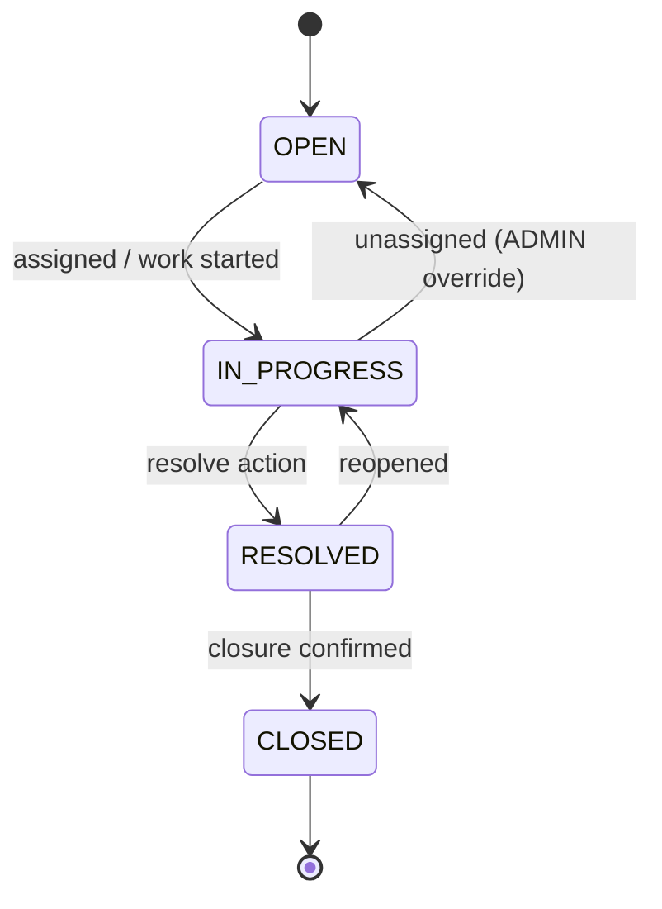

## Appendix B — Glossary

| Term | Definition |
|---|---|
| **AI Processed** | Boolean flag indicating the AI workflow (Section 15) has completed for an incident |
| **Keyword Lookup** | The MVP1 retrieval step: a plain Elasticsearch `multi_match` query against runbooks/incidents, used as prompt context for the resolution suggestion — no embeddings involved |
| **DLQ** | Dead Letter Queue — Kafka topic capturing events that failed processing after retry exhaustion |
| **Outbox Pattern** | Reliability pattern ensuring DB writes and Kafka publishes are eventually consistent even if the publish fails transiently |
| **RAG** (MVP2 term) | Retrieval-Augmented Generation — retrieving semantically similar resolved incidents via vector search before prompting the LLM. Deferred; MVP1 uses keyword lookup instead (see Appendix C) |
| **kNN Search** (MVP2 term) | k-Nearest-Neighbors vector similarity search. Deferred; not used in MVP1 |

## Appendix C — MVP2 Backlog (Deferred Scope)

The following are intentionally out of scope for MVP1 but the schema and architecture leave room to add them without rework:

| Item | What it adds | Where it plugs in |
|---|---|---|
| Embeddings (`nomic-embed-text` via Ollama) | Semantic vector representation of incidents | `embedding_vector_id` column already reserved on `incidents` (Section 4.1) |
| Vector search (`dense_vector` + kNN in Elasticsearch) | True semantic similar-incident search | Extends the `incidents` index mapping (Section 12.1); powers `GET /incidents/{id}/similar` (Section 6.1) |
| Full RAG pipeline | Multi-hop retrieval + reranking before LLM prompting, possibly via LangChain | Replaces the keyword-lookup step in `resolution_suggestion_service` (Section 15.1, step 5–6) |
| Confluence / GitHub integrations | Live-synced runbooks instead of static seed files | New ingestion service/job feeding the `runbooks` index (Section 12.2) |
| Document ingestion pipeline | Continuous sync instead of one-time bootstrap seeding | Scheduled job or webhook-driven indexer replacing the bootstrap seed script |

None of these require changes to the Kafka contract, the callback pattern, or the core CRUD/auth surface — they extend the Intelligence Tier and Elasticsearch layer only.

---

*End of Document — IncidentIQ SDD v1.1 (MVP1 Scope)*